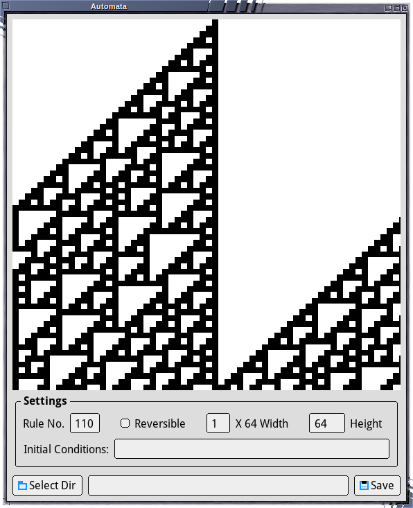
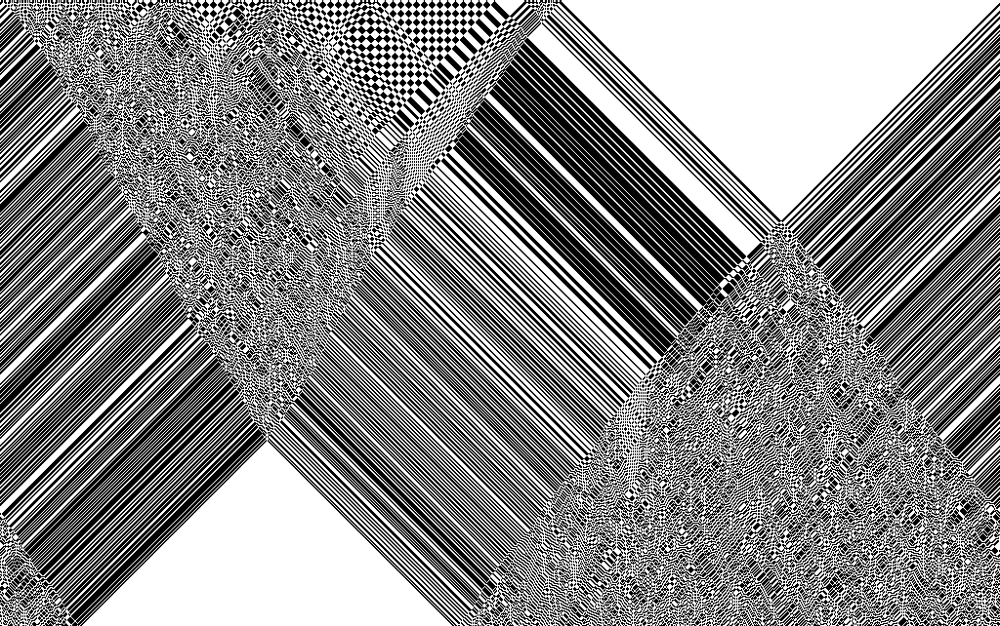
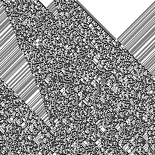

# GFXPrim Automata

This is an automata explorer using the
[GFXPrim](http://gfxprim.ucw.cz/index.html) graphics library.





Presently it implements a nearest neighbor one dimensional cellular
automata and the reversible variants of each rule. The implementation
is described on
[richiejp.com/1d-reversible-automata](https://richiejp.com/1d-reversible-automata).

## Command Line

If the command line switch `-f <file path>` is specified then
`automata` will save an image to `<file path>` and exit. For example:

```sh
$ ./automata -w 4 -h 256 -i "Shell Example" -f ./210r-256x256.png -r 210 -e
```

Produces


