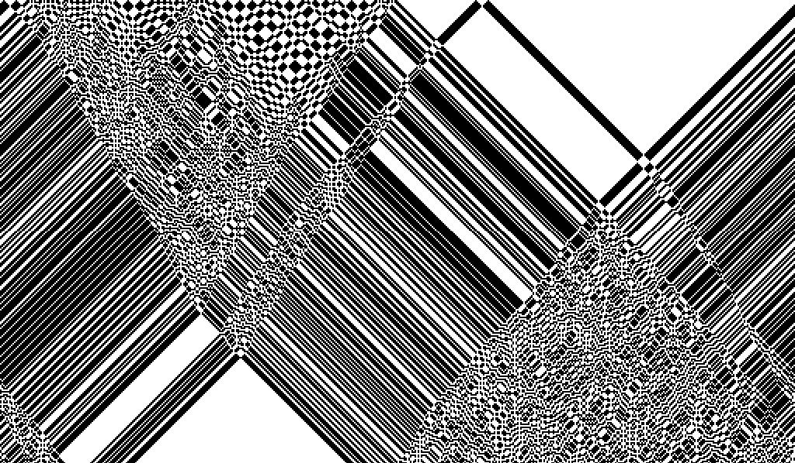

# GFXPrim Automata

This is an automata explorer using the
[GFXPrim](http://gfxprim.ucw.cz/index.html) graphics library.

Presently it implements a nearest neighbor one dimensional cellular
automata and the reversible variants of each rule. The implementation
is described on
[richiejp.com/1d-reversible-automata](https://richiejp.com/1d-reversible-automata).
